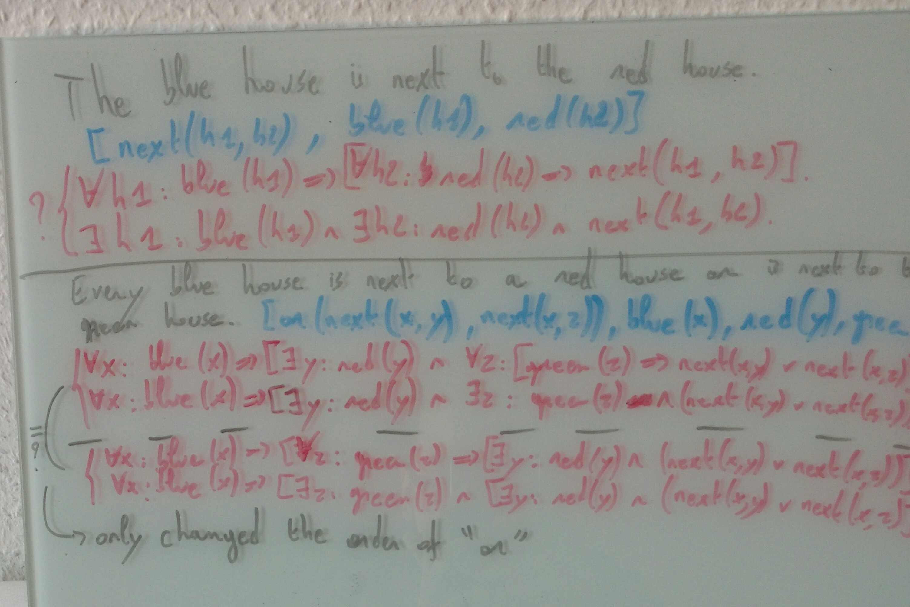

# Meeting thesis 24 november 2016

- the norwegian lives in a house that is next to the blue house
    - Correct:
        - `!x1: lives(norwergian, x1) => ?x2: is_next_to(x1, x2) & color(x2, blue).`
        - `!x1: !x2: lives(norwegian, x1) & color(x2, blue) => is_next_to(x1, x2).`
        - There is a blue house next to the house in which the norwegian lives.
    - Now
        - `∃ x1: ∀ x2: color(x2, blue) ∧ [is,next,to](x1, x2) => lives(norwegian, x1)`.
        - norwegian lives in a house or all houses next to a house are not blue

- there is a person who lives in the green house and drinks coffee
    - `∃ x1: ∀ x2: color(x2, green) => lives(x1, x2) ∧ drinks(x1, coffee).`
    - "Als hem niet in het huis woont, mag het huis niet groen zijn"

- binaire quantificatie: welke 2 leden vooral belangrijk
- ? ! vooral probleem
- "that is" subsentence eens bekijken of die nog problemen geeft.

- Andere zinnen bedenken met gemixte quantoren:
    - every depertament with a large budget, has at least 1 paid employee
- Best eerste quantoren, dan andere puzzle
- ! ? of ? ! niet in zelfde scope => Warning als het dat wel doet?

# Week van 24 november t.e.m. 1 december 2016

- 
    - Algorithm
        1. Get order of quantifiers from sentence
        - Find all variables used for every term in the list
        - Output all predicates without variables
        - Output "&"
        - Pop first quantifier from list and output it
        - Pop predicates from list that only use the variable just quantified. Combining them with "&".
        - Output the right combination (=> for forall, & for exists).
        - Pop predicates from list that only use variables quantified over already and output them. Combining them with "&".
        - Go to 5 unless list is empty.
    - terms({}) & !? x1: terms({x1}) &=> terms({x1}) & !? x2: terms({x2}) &=> terms({x1, x2}) & ... 

- [ ] The: both existential and universal quantification?
    - The blue house is next to the red house
        - `! h1: blue(h1) => (!h2: red(h2) => next(h1, h2))`
        - `? h1: blue(h1) & (?h2: red(h2) & next(h1, h2))`
    - so not assuming there is exactly one but do assume there is at least one!
    - See difference with:
    - Every blue house is next to the red house.
    - The above doesn't assume there is a blue house. The first sentence does
    - 
        - ~~Sentence2: Without the combination of both quantifiers, the order of "or" matters.~~ **EDIT**: the "or"-construct was fixed
            - In order 2: a world with only blue houses is a model.
            - In order 1: a blue house implies the existence of a red house so only blue houses is not a model.
- [ ] Double parses
    - The norwegian lives in a house that is next to the blue house or is next to the green house.
    - oplossen op basis van type en anders warning/error?
- And/or reordening
    - 
- How to write structured quantifiers
    - 
    - 
    
- Problems:
    - Hoofdwerkwoord altijd helemaal in het binnenste?
        - Wat met 1 quantor?
    - or/and: quantoren naar binnen pushen?
        - Vooral problemen met exists/every in een and/or. Die moet naar binnen. 
        - "Every blue house is next to a red house or is next to every green house" zou waar moeten zijn in een wereld met enkel blauwe huizen.
            - Huidige vertaling: `∀x1: color(x1,blue) => ∃x2: color(x2,red) ∧ ∀x3: color(x3,green) => [is,next,to](x1,x2) ∨ [is,next,to](x1,x3)`
            - Andere volgorde or: `∀x1: color(x1,blue) => ∀x2: color(x2,green) => ∃x3: color(x3,red) ∧ [is,next,to](x1,x2) ∨ [is,next,to](x1,x3)`
    - Wat met meerdere termen met dezelfde quantoren: mogen die allemaal in conditie gedeelte staan of moet er ook nog geïmpliceerd gedeelte?

- Oplossingen:
    - 
        - Vb1: Hoofdwerkwoord mag niet altijd naar binnen.
        - Vb2: Bij 1 quantor moet het wrs wel.
        - Vb3: Hww staat hier al in het midden, maar zin is fout door and/or. (Poging om te zien of het nog in andere gevallen naar binnen moest, namelijk als binnenste quantor geen head heeft, enkel body)
    - 
        - If any of the two operands of and/or is only over a subset of the variables, move the and/or up the tree.
        - (Use head clause in implication if no implicated term available)
        - Still doesn't work for the first example: a world with only blue houses is not a model of the given sentence.
        - Linear tree is not possible. Need for a real tree of quantifiers (at least in the and/or parts)
    - Finale oplossing:
        - Verzamel Quantifiers in and/or tree's (niet de predicaten, die gewoon in lijst verzamelen).
        - Volg tree van Quantifiers
        - Binnen één lineaire branch van de tree: volg vorig algoritme.
        - Indien er geen head is, neem "het hoofd" van de zin als head.

